## 各种设备安装存储端

### 1. 群晖

**1.点击“ [存储端下载](https://firmware.koolshare.cn/binary/LinkEase/Synology/)”，下载Synology插件，此处选择"X86"；**

<!-- <font color="#ff0000">*请根据自己电脑上的CPU型号选择相对应的存储端</font><br /> -->
*请根据自己电脑上的CPU型号选择相对应的存储端


**2.登录群晖操作系统，点击套件中心，在出现的套件中心弹窗上点击“手动安装”；**


**3.选择已下载的插件上传，按照指示步骤完成插件安装；**


**4.插件安装完成后，点击群晖系统左上角“主菜单”，在出现的主菜单页面点击“易有云”或“易有云设置”均可进入易有云向导页面；**


[**5.安装后第一次打开，需要绑定设备。点击此处，进入易有云软件统一绑定教程**](./tutorial/NAS/BindingSoftware.md)


### 2. 威联通

**1.点击“ [存储端下载](https://firmware.koolshare.cn/binary/LinkEase/QNAP/)”，下载QNAP插件，此处选择"LinkEaseAgent_0.2.83_x86_64.qpkg"；**

<!-- <font color="#ff0000">*请根据自己电脑上的CPU型号选择相对应的存储端</font><br /> -->
*请根据自己电脑上的CPU型号选择相对应的存储端

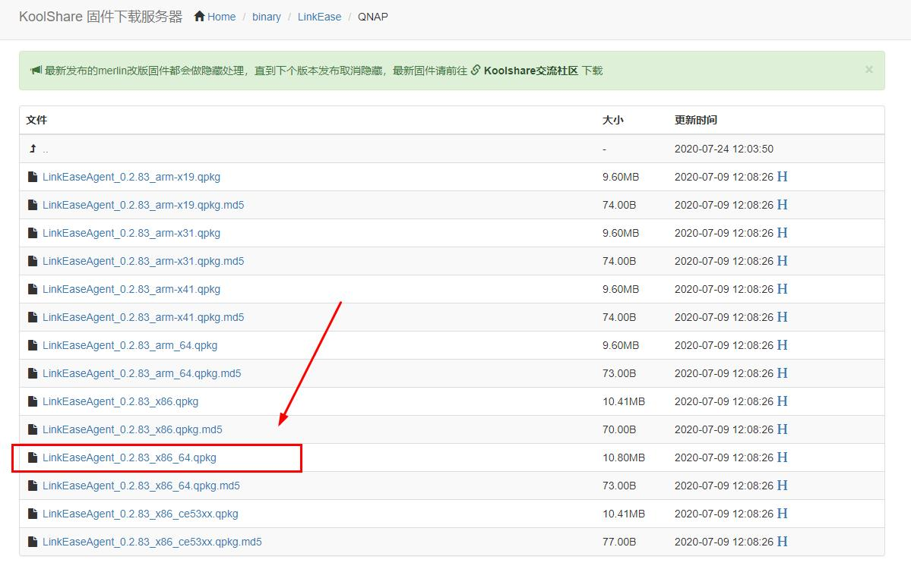

**2.登录QNAP操作系统，点击"APP Center"，在出现的APP Center弹窗上点击“安装软件图标”；**


**3.选择已下载的插件上传，按照指示步骤完成插件安装；**

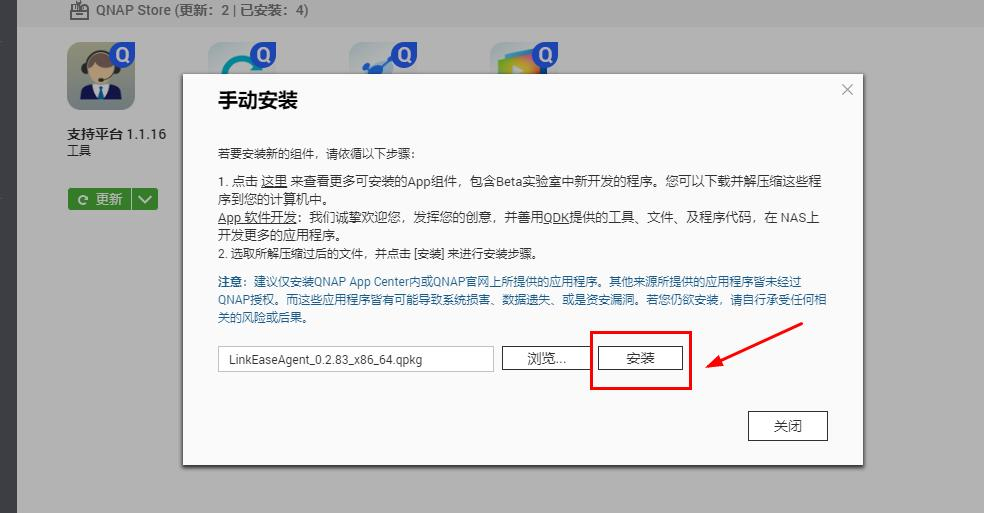

**4.插件安装完成后，点击APP Center弹窗上出现的“易有云”或主页面上的“易有云”均可进入易有云向导页面；**


[**5.安装后第一次打开，需要绑定设备。点击此处，进入易有云软件统一绑定教程**](./tutorial/NAS/BindingSoftware.md)


### 3. 华硕NAS
[存储端下载链接](https://firmware.koolshare.cn/binary/LinkEase/Asus-Nas/)

**1.首先，下载易有云APK。访问NAS主页面，打开华硕`App Central`：**


**2.然后，点击`管理`菜单选项，选择`手动安装`选项卡。点击`浏览`按钮，选择下载好的APK文件**


**3.点击`上传`按钮，上传插件，等待华硕检查完成。勾选`我了解安装未经验证的app的风险`并点击`安装`，等待安装完成。**


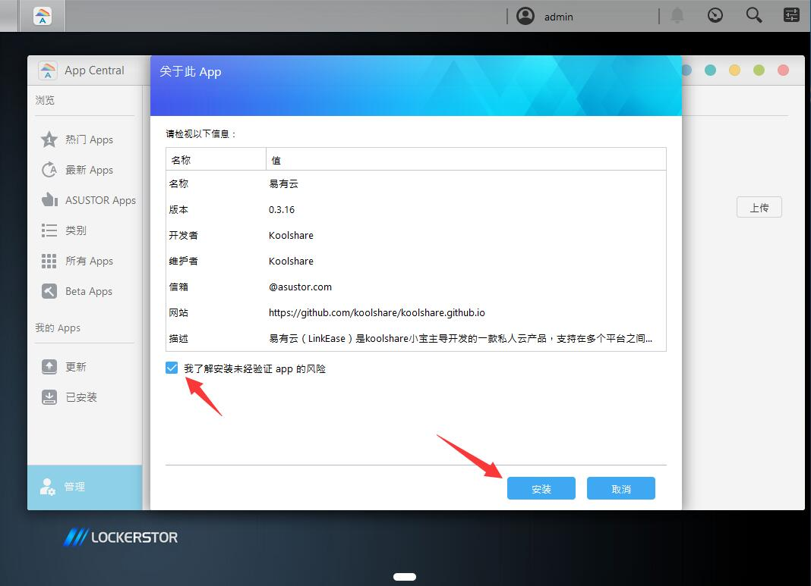

**4.安装完毕后，框内是插件开关，打开后会启动插件，点击红色箭头处的按钮，即可访问易有云界面。**

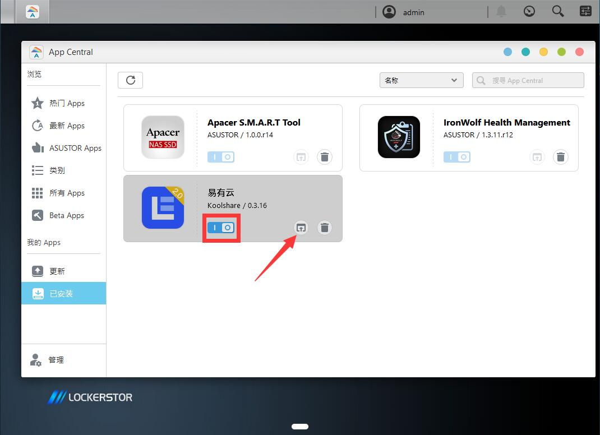

[**5.安装后第一次打开，需要绑定设备。点击此处，进入易有云软件统一绑定教程**](/tutorial/NAS/BindingSoftware.md)


### 4. Koolshare梅林
*绑定设备前，请确保您已在路由器端接入容量不小于16GB的存储设备，如U盘，移动硬盘等；

**1.登录固件管理端，点击“软件中心”，进入软件中心页面。点击“未安装”，进入未安装的插件页面；**


**2.选中“易有云2.0”，点击“安装”，安装易有云插件；**


**3.安装完成后，在“已安装”页面找到易有云2.0插件，单击打开；**


**4.调整开关状态为“开启”，点击“配置中心”，进入易有云2.0向导页面；**

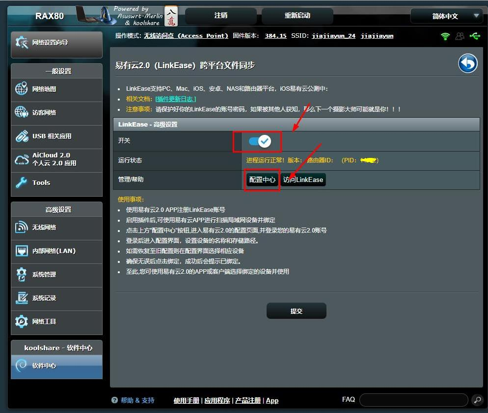

[**5.安装后第一次打开，需要绑定设备。点击此处，进入易有云软件统一绑定教程**](/tutorial/NAS/BindingSoftware.md)


### 5. Koolshare Lede 
*绑定设备前，请确保您已在路由器端接入容量不小于16GB的存储设备，如U盘，移动硬盘等；

**1.登录设备固件管理端，点击“酷软”，进入软件中心页面。点击“未安装”，进入未安装的插件页面；选中“易有云2.0”，点击“安装”，安装易有云插件；**

*易有云1.0和易有云2.0为2个不同插件，安装时，请确认安装的为易有云2.0；

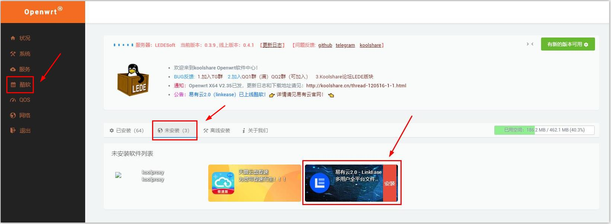

**2.安装完成后，在“已安装”页面找到易有云2.0插件，单击打开；**


**3.勾选“开启LinkEase”，点击“保存”，开启运行易有云2.0；**


**4.确认易有云进程正常开启后，点击“WEB控制台”一栏右侧网址，进入易有云2.0向导页面；**


[**5.安装后第一次打开，需要绑定设备。点击此处，进入易有云软件统一绑定教程**](./tutorial/NAS/BindingSoftware.md)


### 6. Openwrt
*绑定设备前，请确保您已在路由器端接入容量不小于16GB的存储设备，如U盘，移动硬盘等；

**1.OpenWrt固件开发者众多，部分固件不自带易有云，可通过以下任一脚本轻松安装：**

   via curl
```
sh -c "$(curl -sSL http://firmware.koolshare.cn/binary/LinkEase/Openwrt/install_linkease.sh)"
```
   via wget
```
sh -c "$(wget --no-check-certificate -qO- http://firmware.koolshare.cn/binary/LinkEase/Openwrt/install_linkease.sh)"
```
   others
```
cd /tmp; wget --no-check-certificate http://firmware.koolshare.cn/binary/LinkEase/Openwrt/install_linkease.sh; sh ./install_linkease.sh
```

**2.在OpenWrt TTYD终端中输入任一上述命令，会自动安装完成。**


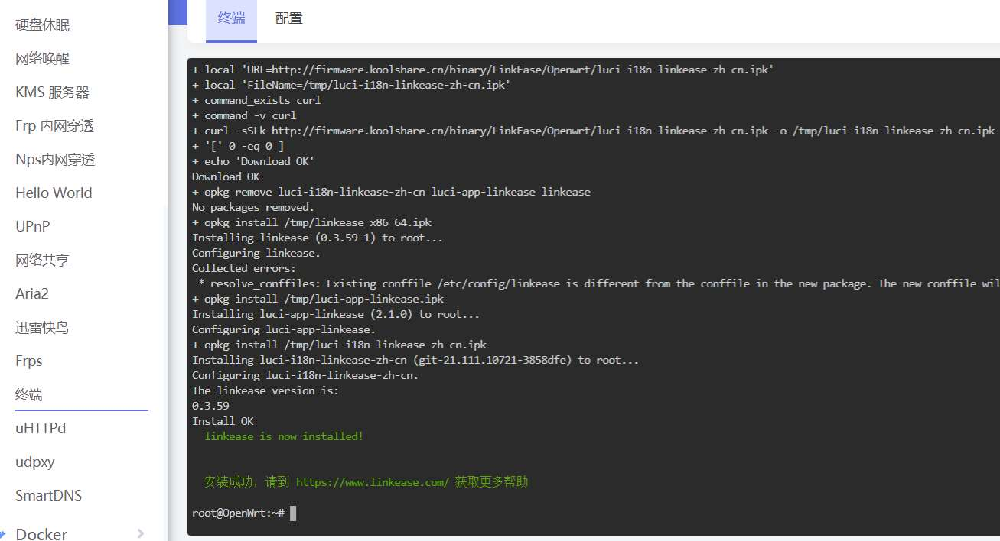

**3.然后找到易有云，启用并应用保存，然后点击“打开易有云”。**

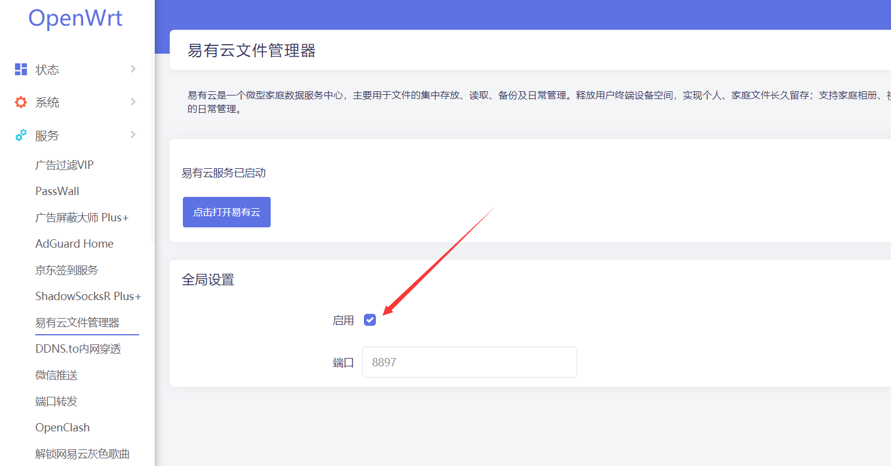

**4.或者putty、MobaXterm等软件登陆SSH，输入任一上述命令，会自动安装完成。**

[**5.安装后第一次打开，需要绑定设备。点击此处，进入易有云软件统一绑定教程**](./tutorial/NAS/BindingSoftware.md)


### 7. Linux 通用版
[存储端下载链接](https://firmware.koolshare.cn/binary/LinkEase/LinuxStorage/)

<font color="#ff0000">*请根据自己电脑上的CPU型号选择相对应的存储端</font><br />


**1.首先在命令窗口中登录您的linux系统**

<font color="#ff0000">以下按照我本机上的文件目录作为解说：</font><br />

**2.在光标后输入“cd mtb” ，点击回车，进入mtb目录中（mtb为您下载文件后存放的目标目录）。输入“ls”确认；**
 <table><tr><td bgcolor=#bae2fe>cd mtb</td></tr></table>

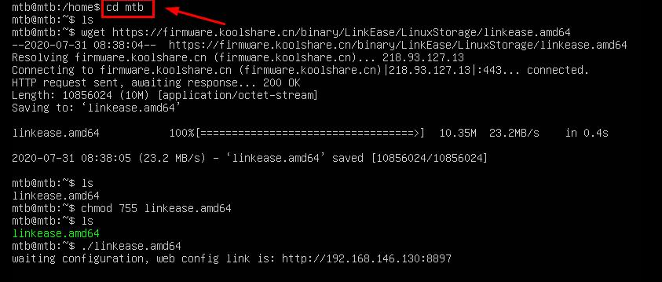

**3.在光标后输入"wget 存储端链接"，点击回车，下载易有云存储端。输入“ls”确认；**
 <table><tr><td bgcolor=#bae2fe>wget 
https:/ / firmware.koolshare.cn/binary/LinkEase/LinuxStorage/linkease.amd64</td></tr></table>

<font color="#ff0000">以上网址为易有云linux通用版存储端链接，后期有可能会更改，请您随时关注更新；</font><br />

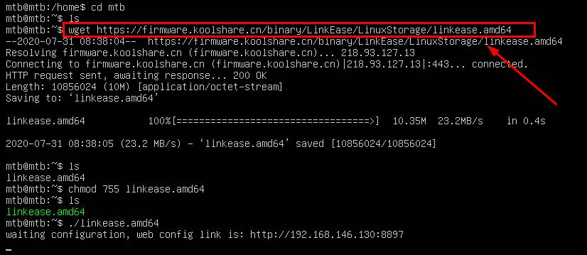

**如何获取易有云linux存储端链接**

点击[存储端下载链接](https://firmware.koolshare.cn/binary/LinkEase/Synology/)，打开易有云存储端下载链接。右键“linkease.amd64”文件，在出现的弹窗中单击“复制链接地址”，即可复制该存储端链接。

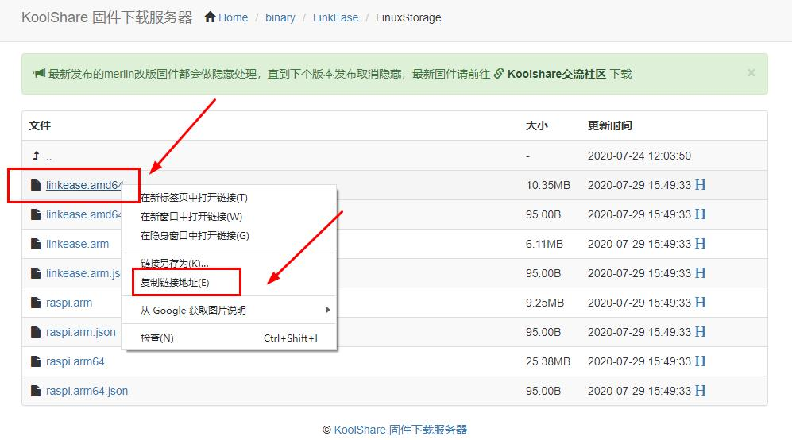

**4.在光标后输入“chmod 755 linkease.amd64”给予软件运行权限。输入“ls”确认；**
<table><tr><td bgcolor=#bae2fe>chmod 755 linkease.amd64</td></tr></table>


**5.在光标后输入“./linkease.amd64”，点击回车，运行软件；**
<table><tr><td bgcolor=#bae2fe>./linkease.amd64</td></tr></table>


**6.复制命令窗中出现的网址在浏览器中打开，即可进入易有云向导页面**

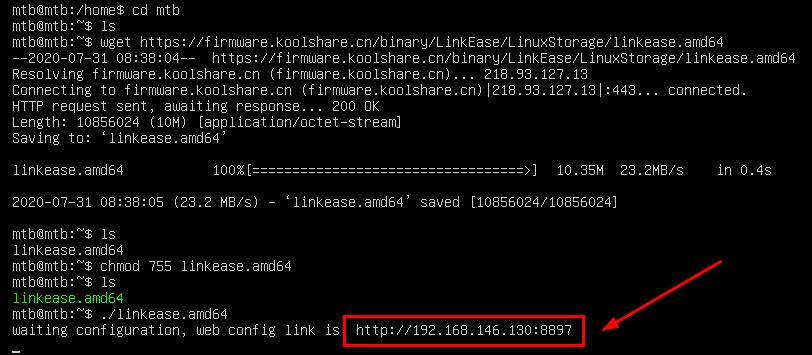

[**7.安装后第一次打开，需要绑定设备。点击此处，进入易有云软件统一绑定教程**](./tutorial/NAS/BindingSoftware.md)


### 8. ReadyNAS

TODO


### 9. Docker

[镜像地址](https://hub.docker.com/r/linkease/linkease/)


通过以下命令安装即可：

```
docker run -d \
    --cap-add=NET_ADMIN \
    -p 8897:8897 \
    --name=<container name> \
	--network host \
    -v <path for data files>:/linkease-data \
    -v <path for config files>:/linkease-config \
    -v /etc/localtime:/etc/localtime:ro \
    -e PUID=<uid for user> \
    -e PGID=<gid for user> \
    linkease/linkease:latest
```

--cap-add、-e PUID、-e PGID 这几个参数若不知道可不填。

PS：获取UID和GID，终端输入id回车即可。


   
比如上图获取的UID和GID都是0。


#### 注意事项：

易有云尽可能使用点对点进行网络传输，所以在使用 Docker 的时候，为了避免给易有云增加了一层 NAT，建议网络配置使用：

**Host 模式：**
即用本主机的网络，减少了一层NAT

**Custom br0 模式：**
即把Docker里面的网络连接到一个局域网中，最好是得到根主机一个网段的IP，也能少一层NAT

否则会让易有云无法充分利用本地局域网的网络通信，影响网速，同时影响网络发现、远程samba等等功能特性。(即可以通过易有云远程访问局域网其它的samba共享路径)


## 存储端统一绑定教程

易有云存储端安装后第一次打开，需要绑定设备。易有云存储端与客户端一一对应，绑定成功后，每次在存储端登录时，需使用绑定的账号登录。否则，在该存储端的向导页面将无法登录；

**1.在易有云2.0向导页面登录客户端；**

 ①方式一：打开手机易有云，扫描登录二维码登录；<br/>
 ②方式二：输入您所注册的易有云账号密码进行登录；


**2.登录后，进入设备初始设置页面，设置设备名称及初始目录路径；**
* 双击选择路径，可以选择NAS内的目录，也可以选择你的挂载的硬盘目录，这个目录会用来存放易有云的配置文件（不是你分享的数据）。
* 绑定完成后，您可前往“个人空间”查看该初始目录路径下的文件数据。

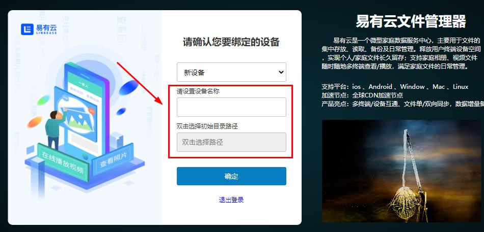

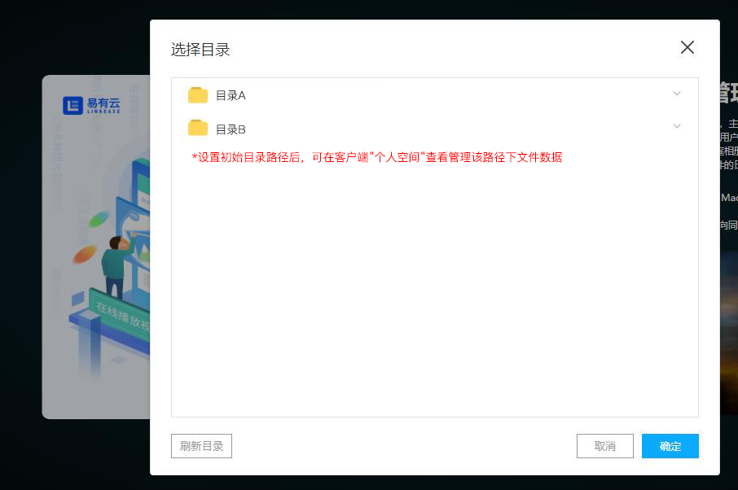

**3.操作成功后，即可在易有云2.0客户端使用该账号管理设备文件。**


