## 绑定设备

管理员如何绑定设备？

**绑定设备：开启手机WiFi，并确保您的手机与要绑定的设备在同一路由器网络下。**

**1.打开手机App，系统会自动扫描局域网内可绑定设备，点击进入搜索的设备列表页面；**

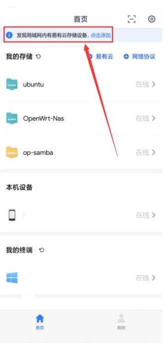

**2.点击要绑定的设备，进入绑定设备确认页面；**

**3.点击“下一步”，进入设备初始设置页面；**

**4.根据页面提示设置好“设备名称”及“初始路径”，点击“确定”按钮即可绑定设备；**

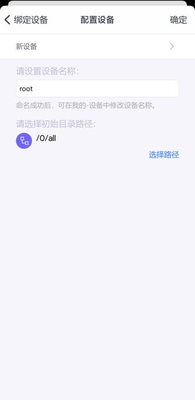

***也可以点击首页的“+易有云”按钮，通过扫描设备二维码等其他方式绑定设备。**

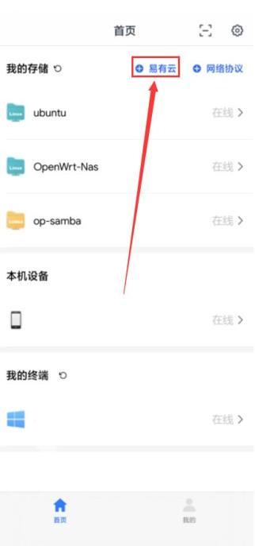

 ***首位用户绑定设备后成为该设备的管理员，一个设备只能有一个管理员。** 

## 共享设备

管理员如何共享设备？

**只有管理员才能主动分享设备，每台设备最多可邀请多位成员共享。(目前最多3位，后续敬请期待)**

**1.设备管理员在首页点击右上角的“齿轮”按钮，点击要共享设备的“成员管理”，然后添加成员，输入受邀成员的手机号。**

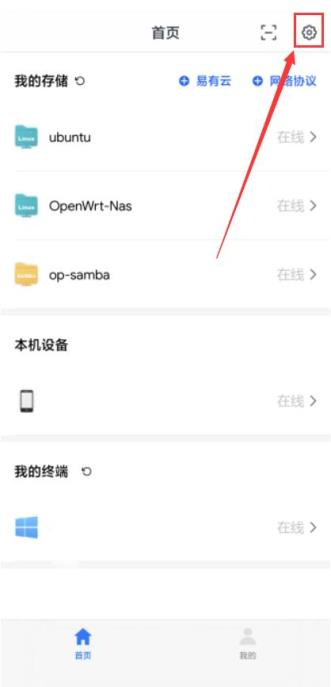

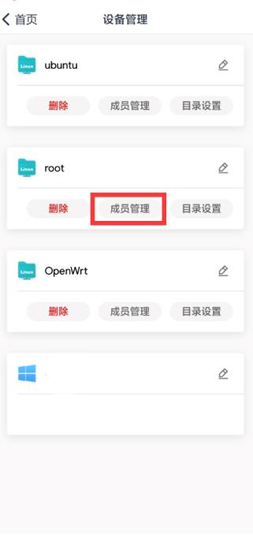

**2.受邀成员在首页点击“+易有云”按钮，出来弹窗点击“接受共享设备”的消息中接受设备邀请即可共享该设备。**

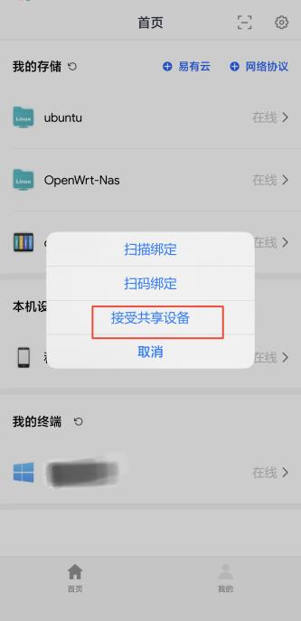

## 取消共享

如何解绑和取消共享？

**易有云APP首页，在网络列表里点击已共享设备的“成员管理”，然后看到共享的成员，删掉即可。**

 ***设备删除和取消共享后，将会删除该用户在这台设备上的所有个人空间数据，且无法找回，请谨慎操作！** 

## 相册备份

如何备份相册呢？

**1.易有云APP打开“我的”，然后点击“照片备份”；**

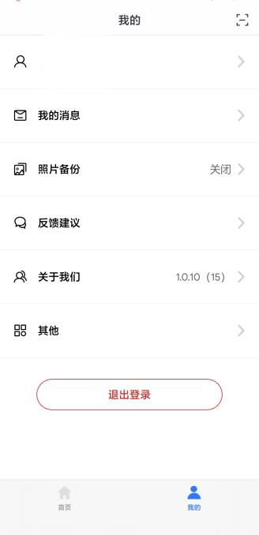

**2.然后继续点击“照片备份”，出来的弹窗点击“选择目标设备”；**

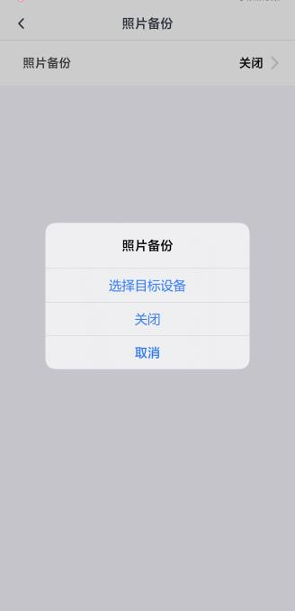

**3.然后选择设备；**

**5.设置好就可以点击立即开始备份，以后就可以自动备份相册了。**

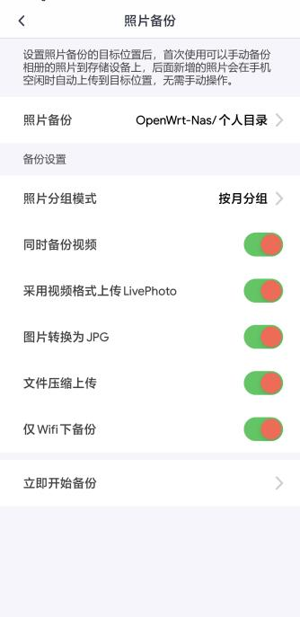

## 微信互传

如何实现文件在微信与易有云之间的互传（iOS）？

### 1.下载

使用微信分享易有云已下载文件

**在操作前，请先在易有云APP里下载需要传输的文件**

**1.在微信聊天窗里点击“+号-文件”；**

**2.在文件目录选择页面，切换并选中“icloud”；**

**3.在出现的页面中，点击左上角“浏览”，然后点击“我的iPhone”，并点击进入易有云Lite文件列表页面；**

**4.在易有云Lite里的download文件夹中选中要分享的文件后即可分享文件给微信群/好友。**

### 2.上传

使用微信上传文件至易有云

*此方式限制文件大小不得超过100M（微信本身限制）

**1.在微信中打开要上传的文件；**

**2.点击右上角操作图标，打开操作栏；**

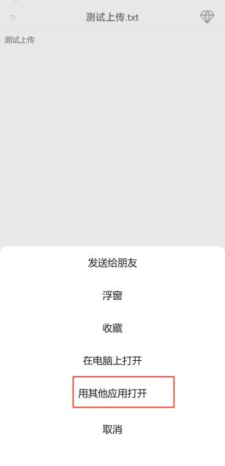

**3.点击“用其他应用打开”；**

**4.选中“易有云”，确定上传即可。**

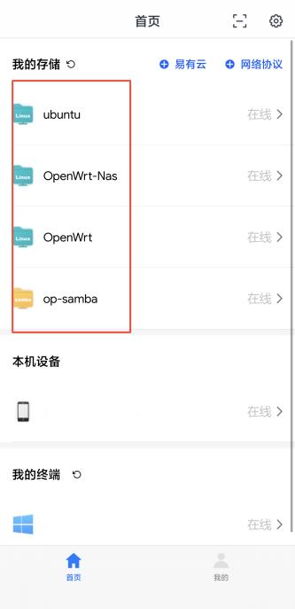

## Samba远程

如何用易有云连接SAMBA远程访问设备文件？
<!-- <blockquote>
<front color="#DC143C">连接前，请手动更新存储端与客户端到最新版本；</front>  -->
连接前，请手动更新存储端与客户端到最新版本；

版本更新：[更新下载](https://www.ddnsto.com/linkease/download/)

**使用场景举例：**

1. 家里路由器安装了易有云 
2. 家里还运行了一台开启了 Samba 服务的设备，且设备上不方便直接安装易有云存储端 
3. 人在公司，需要家里这个 Samba 服务里面的文件

<!-- <blockquote>
<front color="#DC143C"> 已知玩客云、小米硬盘路由不支持，因为他们的 SAMBA 是 1.0 版本，无法支持。目前易有云支持的是 2.x ~ 3.x 版本</front> 
</blockquote> -->
已知玩客云、小米硬盘路由不支持，因为他们的 SAMBA 是 1.0 版本，无法支持。目前易有云支持的是 2.x ~ 3.x 版本

**前期准备：**

1. 路由器正常运行易有云 
2. SAMBA设备正常运行 
3. 手机登录易有云客户端

**绑定流程：**

**1.登录APP，首页点击“+网络协议”，出来弹窗选择SMB/CIFS；**

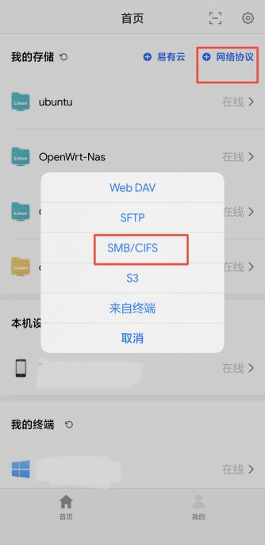

**2.选择关联设备，设备IP为选填项（可选择也可手动输入），建议选择IP，这样数据更准确。**
<!-- <blockquote>
<front color="#DC143C">SAMBA 用户名密码，易有云只存本地客户端，不会存服务器。即使是服务器管理人员，也无法知道密码信息，保证个人数据安全。但就是每个客户端都得单独添加一次。；</front>
</blockquote> -->
SAMBA 用户名密码，易有云只存本地客户端，不会存服务器。即使是服务器管理人员，也无法知道密码信息，保证个人数据安全。但就是每个客户端都得单独添加一次。

**①如果选择了关联设备，那么通信方式如下：**

也就是说，你的本地客户端通过连接关联设备访问到 SAMBA 设备 IP，即在任何外网网络易有云都能保证能连接到 SAMBA。

**②如果不关联设备，那么：**

客户端必须跟 SAMBA 在一个局域网才能访问到 SAMBA 设备。

**端口默认为445，可更改。点击下一步；**

**3.填写工作组，SAMBA设备 用户名和密码，点击下一步；**

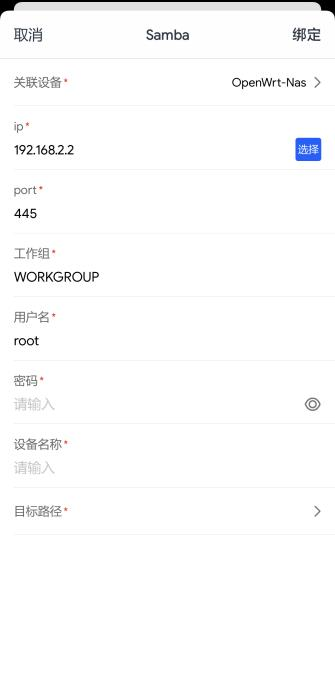

**4.填写SAMBA设备 名称及目标路径，目标路径为选填项（可选择也可手动输入），点击绑定；**

<!-- <blockquote>
<front color="#DC143C">目标路径即为您要访问的SAMBA设备的共享目录</front>
</blockquote> -->
目标路径即为您要访问的SAMBA设备的共享目录

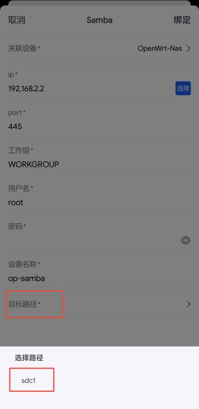

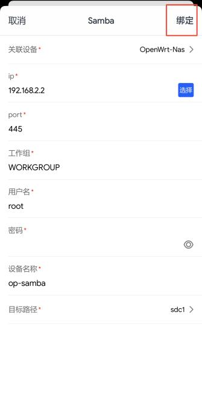

**5.绑定成功后，该虚拟设备出现“首页-网络位置”列表页面，点击此设备，可在该设备的“主目录-全部文件”访问该虚拟设备中的文件。**

<!-- <blockquote>
<front color="#DC143C">SAMBA协议绑定的设备均为虚拟设备，除文件管理外，其他功能均不可用；</front>
</blockquote> -->
SAMBA协议绑定的设备均为虚拟设备，除文件管理外，其他功能均不可用；

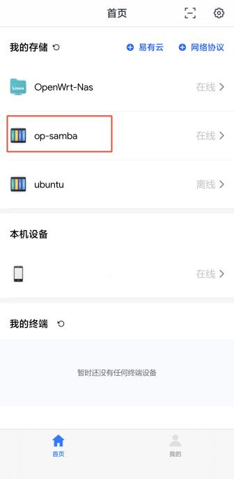

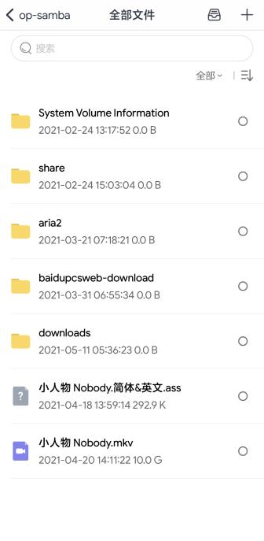

## 目录设置

管理员如何设置设备上的目录？

**1.设备管理员点击首页右上角“齿轮”按钮，进入设备管理页面；**

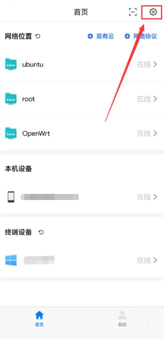

**2.点击设备的“目录设置”，即可进入目录设置页面；**

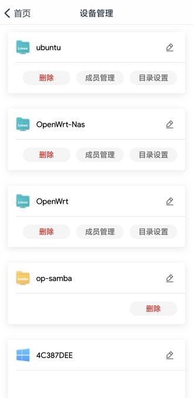

**3.在此页面可进行目录相关设置，设置好提交设置即可。**

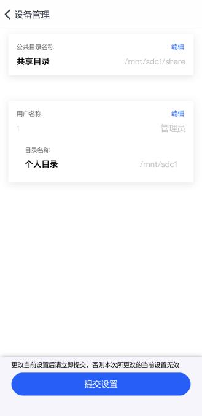

